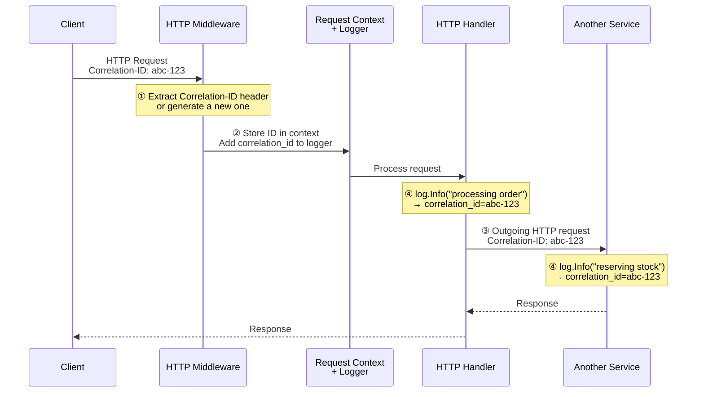

# Logging

Logs are your most basic tool to know what happens in production. We aim to build a complex platform, so adding random `fmt.Println` here and there isn't going to cut it.

Imagine someone can't place their food order, and all they see is a generic "something went wrong" message.
You open the logs, and you see 50,000 lines from five different services, all mixed together.
How can you tell what happened in that user's request? Which service failed? What was the error?

We'd better prepare before that happens.

This is the last walkthrough exercise. No code to write yet. That said, the logging infrastructure we set up is worth understanding before you start building on top of it.

## Go's slog Package

Go 1.21 introduced [`log/slog`](https://pkg.go.dev/log/slog), a **structured logging** package in the standard library. Instead of writing plain text like `fmt.Println("error occurred")`, structured logging uses key-value pairs that can be easily parsed by log aggregation tools. This makes it much easier to search, filter, and analyze logs in production.

The difference looks like this:

```bash
# Unstructured
2024-01-15 14:23:01 error occurred while processing order

# Structured (slog)
[14:23:01.042] ERROR Processing order failed  order_id=ord_123 correlation_id=abc789 error="connection refused"
```

One tells you something went wrong. The other tells you what failed, which order, and which request triggered it.

Take a look at `Init`:

{{codeFile "backend/common/log/slog.go"}}

```go
func Init(level slog.Level) {
	opts := &humanslog.Options{
		HandlerOptions: &slog.HandlerOptions{
			Level: level,
		},
		TimeFormat: "[15:04:05.000]",
	}

	logger := slog.New(humanslog.NewHandler(os.Stderr, opts))
	slog.SetDefault(logger)
}
```

It sets up the global logger using [humanslog](https://github.com/ThreeDotsLabs/humanslog), a handler that produces colored, human-readable output for local development. In production, you'd switch to a JSON handler for your log aggregation system. For the local environment, human-readable output is good enough.

Echo has its own logger interface. `EchoSlogAdapter` in `backend/common/echo.go` wraps slog to satisfy it, so all logs (including Echo's internal messages) go through one system.

## Context-Based Logging

Structured output is only half the story. You also need to see all logs from a specific request, so you can understand the full context of what happened before the error occurred.

A simple solution is to generate a request ID and add it as a attribute to every log line.

But how do you get that request ID in every function that needs to log something?

Passing a logger as a function parameter could work, but it clutters every function signature. Worse, you need to pass it through layers that don't care about logging at all, only to reach the function that does.

With context-based logging, the [middleware](https://academy.threedots.tech/knowledge/middleware) adds request-specific attributes to the logger and stores it in `context.Context`, which is passed to many functions by default.

Look at the **`FromContext`/`ToContext`** pair:

{{codeFile "backend/common/log/log.go"}}

```go
func FromContext(ctx context.Context) *slog.Logger {
	log, ok := ctx.Value(loggerKey).(*slog.Logger)
	if ok {
		return log
	}

	return slog.Default()
}

func ToContext(ctx context.Context, logger *slog.Logger) context.Context {
	return context.WithValue(ctx, loggerKey, logger)
}
```

`ToContext` stores a logger in the context. `FromContext` retrieves it, falling back to the default logger if none is found. (Not perfect, but a missing logger won't crash your app this way.)

This works well with a single error handler. `HandleError` in `backend/common/http/echo.go` uses `log.FromContext`, so error logs automatically include all the log attributes. Errors bubble up through functions and get logged once, in a structured format, and with full context.

```go
func HandleError(err error, c echo.Context) {
	log.FromContext(c.Request().Context()).With("error", err).Error("HTTP error")

	// (...)
```

{{tip}}

The context keys in `backend/common/log/ctx.go` use an unexported `ctxKey` type. This is a common Go idiom: because the type is unexported, no other package can accidentally read or overwrite these context values.

{{endtip}}

{{tip}}

There's another approach to this: instead of storing a logger in context, you can implement slog's `Handler` interface to inspect the context at log time. The handler extracts attributes (like the correlation ID) from the context and adds them to every log record. With this approach, you call `slog.InfoContext(ctx, "msg")` and the handler figures out which attributes to add. Both approaches are widely used. We went with storing the logger in context because it's more straightforward and works well for this project.

{{endtip}}

## Correlation ID

A **[Correlation ID](https://academy.threedots.tech/knowledge/correlation-id)** is a unique string that follows a request to other services and systems.

For example, when a user places an order, that action touches the orders service, the inventory service, and the payments service (and possibly others).
Each service has its own logs, so it's pretty much impossible to understand the full story of what happened by looking at them separately.

With a correlation ID, you search for one string and get the complete picture across every service. You'll see this in action throughout the training: when something fails in your exercises, the correlation ID in the logs will help you trace what happened.

Here's how the correlation ID flows through the system:

1. An HTTP request arrives. The middleware extracts the `Correlation-ID` header or generates a new one.
2. The ID is stored in the request context, and a `correlation_id` attribute is added to the logger.
3. When the service makes outgoing HTTP requests, it injects the same ID into the `Correlation-ID` header.
4. All log lines from all services include the `correlation_id`, making it trivial to get a complete trace of the request.



Check `backend/common/log/correlation.go`. It uses [shortuuid](https://github.com/lithammer/shortuuid) for compact, URL-safe IDs.

```go
func CorrelationIDFromContext(ctx context.Context) string {
	v, ok := ctx.Value(correlationIDKey).(string)
	if ok {
		return v
	}

	FromContext(ctx).Warn("correlation ID not found in context")

	return "gen_" + shortuuid.New()
}
```

When `CorrelationIDFromContext` can't find a correlation ID in the context, it generates one prefixed with `gen_`. If you see `gen_` IDs in production logs, something upstream isn't propagating the correlation ID correctly. The prefix makes this immediately visible.

{{tip}}

In distributed systems, **[distributed tracing](https://academy.threedots.tech/knowledge/tracing)** (e.g., OpenTelemetry) is the modern replacement for correlation IDs. A trace ID replaces the correlation ID, and span IDs show the exact operation within a service.
You get the same cross-service visibility, plus timing, hierarchy, and error propagation.
We cover tracing in our [Go Event-Driven](https://threedots.tech/event-driven/) training, where it truly shines.
For a monolith, correlation IDs are a good starting point.

{{endtip}}

## HTTP Middleware

So how does all of this get wired up? Mostly in middleware.

An HTTP middleware is a function that wraps an HTTP handler, executing some code before or after the handler runs.
This is perfect for cross-cutting concerns like logging, where you want to apply the same logic to every request without cluttering your handler code.

We have a set of middleware in `backend/common/http/middlewares.go`:

1. **The correlation ID middleware.** It extracts or generates the ID, adds the correlation-ID-aware logger to the context, and sets the response header so callers can trace their requests.
2. **The request logger** logs each request's URI, status, method, and latency.
3. Finally, **the body dump middleware** captures request and response bodies for debugging.

You don't need to think about any of this when writing handlers. The middleware runs before your code, and your handler gets a context that already has everything attached. Call `log.FromContext(ctx)` and the correlation ID and any other attributes are already there.

{{tip}}

If you want to learn more about separating observability concerns from business logic, check out our article on [generic decorators](https://threedots.tech/post/increasing-cohesion-in-go-with-generic-decorators/). The middleware pattern used here follows the same idea: keep logging infrastructure out of your application code.

{{endtip}}

## Exercise

Exercise path: ./project

There's nothing to implement yet. Take a look at the code we prepared and continue to the next exercise.

With the project scaffolding, module structure, and logging infrastructure in place, you have the foundation for the rest of the training. Next, we'll start building HTTP handlers.
