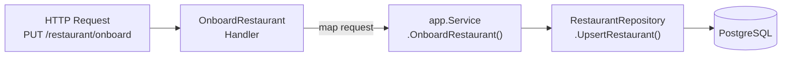

# Onboard Restaurant Endpoint

{{message "milosz"}}

Restaurants won't onboard themselves on our platform.
Instead, our operations team will use an internal dashboard to do it.

{{endmessage}}

With the repository and [application service](https://academy.threedots.tech/knowledge/application-service) in place, let's now expose an HTTP endpoint for the frontend to use.

The new HTTP handler (`OnboardRestaurant`) follows the same pattern as `RegisterCustomer`, so most of this should feel familiar.
The new part is mapping a collection of menu items from the request body to application types.



## The Handler

You need to add the `OnboardRestaurant` handler in `backend/orders/api/http/handler.go`.
It should map the [OpenAPI](https://academy.threedots.tech/knowledge/openapi) request types to application types and call `h.service.OnboardRestaurant`.

It's similar to the `RegisterCustomer` handler with one difference: **you need to map `request.Body.MenuItems` to `[]app.MenuItem` in a loop.**
`RegisterCustomer` has no equivalent collection, so you can't copy this part directly.

The restaurant UUID comes from `request.RestaurantUuid`, a path parameter. You'll need a `float64()` cast for the `Ordering` field.
Convert the address to the application type the same way you did for `RegisterCustomer`.

The OpenAPI spec includes an `Operator-UUID` header in the request.
It identifies the person from the operations team who performs the onboarding.
In a production system, this would come from some kind of API gateway doing authentication before routing the request to our service.
You don't need to use it for now.

## Wiring

To wire everything together, add `restaurantRepository` as a parameter to `NewService` in `backend/orders/app/service.go`. Add a nil check following the existing pattern for `customerRepository`, and remove the TODO comment.

Then create the repository in `backend/orders/module.go` using `db.NewRestaurantRepository(m.pgxDb)` and pass it to `app.NewService`.

## Exercise

Exercise path: ./project

1. **Regenerate the OpenAPI code** by running `task gen` or `go generate ./...`.

2. **Implement `OnboardRestaurant`** on `Handler` in `backend/orders/api/http/handler.go`.
    * Map the request body fields to `app.OnboardRestaurant` and `[]app.MenuItem`.
    * Call `h.service.OnboardRestaurant`.
    * Return `OnboardRestaurant204Response{}`.

3. **Inject `restaurantRepository`** into `NewService` in `backend/orders/app/service.go`. Add the `RestaurantRepository` parameter, a nil check, and the struct field. Remove the existing TODO comment.

4. **Wire the repository** in `backend/orders/module.go`. Create `restaurantRepo` using `db.NewRestaurantRepository(m.pgxDb)` and pass it to `app.NewService`.

The tests verify that your endpoint accepts restaurant data, returns HTTP 204, and persists it to the database.

{{hints}}

{{hint 1}}

The menu items mapping is the only part you can't copy from `RegisterCustomer`. You need to loop over `request.Body.MenuItems` and build a `[]app.MenuItem` slice. Each `MenuItem` has `MenuItemUUID`, `Name`, `GrossPrice`, and `Ordering` fields.

The `Ordering` field requires a `float64()` cast because the OpenAPI type is `number`, but the application type uses `float64`.

{{endhint}}

{{hint 2}}

The handler signature and the menu items mapping look like this:

```go
func (h Handler) OnboardRestaurant(ctx context.Context, request OnboardRestaurantRequestObject) (OnboardRestaurantResponseObject, error) {
    var menuItems []app.MenuItem
    for _, item := range request.Body.MenuItems {
        menuItems = append(menuItems, app.MenuItem{
            MenuItemUUID: item.Uuid,
            Name:         item.Name,
            GrossPrice:   item.GrossPrice,
            Ordering:     float64(item.Ordering),
        })
    }

    // ...
```

You need a new dependency in the application service constructor:

```go
func NewService(
    customerRepository CustomerRepository,
    restaurantRepository RestaurantRepository,
    modules ModulesContract,
) *Service {
```

{{endhint}}

{{endhints}}
