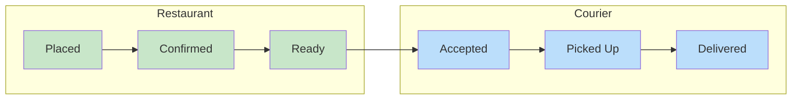

# Courier Delivery Workflow

The restaurant accepted the order and marked it ready. Now someone needs to pick it up.

That someone is the courier. Three endpoints complete the delivery side of the order lifecycle: accept delivery, report pickup, and report delivery. All three use the `updateFn` pattern from {{exerciseLink "restaurant order management" "11-complete-flow" "04-restaurant-order-management"}}, applied from the courier's perspective instead of the restaurant's.

This exercise completes the full order flow. The courier commands fill in the last part of the board.

{{miroBoard}}

Here's the full order lifecycle. The blue stages are what you'll build in this exercise:



## The Three Endpoints

| Endpoint | Method | Auth Header | Request Body | Success |
|----------|--------|-------------|-------------|---------|
| `/orders/courier/accept-delivery` | POST | `Courier-UUID` | `AcceptDelivery` with `order_uuid` | **202** |
| `/orders/courier/report-pickup` | POST | `Courier-UUID` | `ReportPickup` with `order_uuid` | **202** |
| `/orders/courier/report-delivery` | POST | `Courier-UUID` | `ReportDelivery` with `order_uuid` | **202** |

The [OpenAPI](https://academy.threedots.tech/knowledge/openapi) spec already defines these endpoints. The handlers are straightforward: they delegate to the service and return 202.

All three service methods use `UpdateOrder` with `updateFn`, same approach as {{exerciseLink "restaurant order management" "11-complete-flow" "04-restaurant-order-management"}}'s restaurant endpoints.

## Delivery Zone Validation

That said, accept-delivery has one new requirement.

**A courier should only accept orders in the same city they operate in.** Your service should compare the courier's registered city against the order's delivery address city. It's an exact city string match, not geographic distance.

The city lookup happens before `UpdateOrder`, outside the transaction. This is safe because a courier's city is set once at registration and never changes.

{{tip}}
If couriers could change their city, reading it outside the transaction wouldn't be safe. You could handle that with a dedicated repository method:

```go
AssignCourierToOrder(
    ctx context.Context,
    orderUUID OrderUUID,
    courierUUID CourierUUID,
    validateFn func(ctx context.Context, order Order, courierCity string) error,
) error
```

The repository reads the courier city and the order inside the same transaction, calls `validateFn` for zone validation, and updates the order itself. Our example solution keeps it simple since the city is immutable.
{{endtip}}

Not the most efficient validation, but it's good enough for our purposes.

Accept delivery also enforces **one courier per order**. If another courier already accepted, reject with code 409 and slug `"already-accepted"`.

## Pickup and Delivery

In contrast, report-pickup and report-delivery are familiar.

Both follow the [idempotent](https://academy.threedots.tech/knowledge/idempotency) pattern from {{exerciseLink "restaurant order management" "11-complete-flow" "04-restaurant-order-management"}}: verify the courier, check idempotency, set the timestamp. You already know the drill.

Your authorization check works differently from the restaurant side, though. Your restaurant match helper only had to compare two UUIDs: the order's restaurant against the requesting restaurant. The courier version has an extra case.

If no courier has been assigned to the order yet (`CourierUUID` is nil), report-pickup and report-delivery should return 409. You can't report progress on an order nobody has accepted. If a courier is assigned but doesn't match the requesting one, return 403.

**Once you have the authorization helper, the service methods for pickup and delivery are almost identical to the restaurant methods from {{exerciseLink "restaurant order management" "11-complete-flow" "04-restaurant-order-management"}}.**

## Exercise

Exercise path: ./project

Build the courier side of the order lifecycle. Three endpoints let a courier accept a delivery, report pickup, and report delivery.

1. Add a `GetCourierCity` query to `backend/orders/adapters/db/queries/couriers.sql` and a matching method on the `CourierRepository` interface. Run `task gen` afterward (or `go generate ./...` if you don't use Task).

2. **Accept delivery** (`POST /orders/courier/accept-delivery`):
   - Fetch the courier's city from the courier repository
   - Reject if another courier already accepted the order (409, slug `"already-accepted"`)
   - Reject if the courier's city does not match the order's delivery address city (400, slug `"courier-out-of-delivery-zone"`)
   - The zone validation error should include details:

   ```json
   {
     "slug": "courier-out-of-delivery-zone",
     "details": [
       {
         "entity_type": "order",
         "error_slug": "courier-out-of-delivery-zone"
       }
     ]
   }
   ```

   - On success: set `CourierUUID` and `CourierAcceptedAt`, return 202

3. **Report pickup** (`POST /orders/courier/report-pickup`) and **report delivery** (`POST /orders/courier/report-delivery`):
   - Verify the requesting courier is assigned to the order. If no courier is assigned, return 409. If the courier doesn't match, return 403
   - **Both operations should be idempotent.** If the timestamp is already set, log a warning and return the order unchanged
   - On success: set `PickedUpAt` or `DeliveredAt`, return 202
