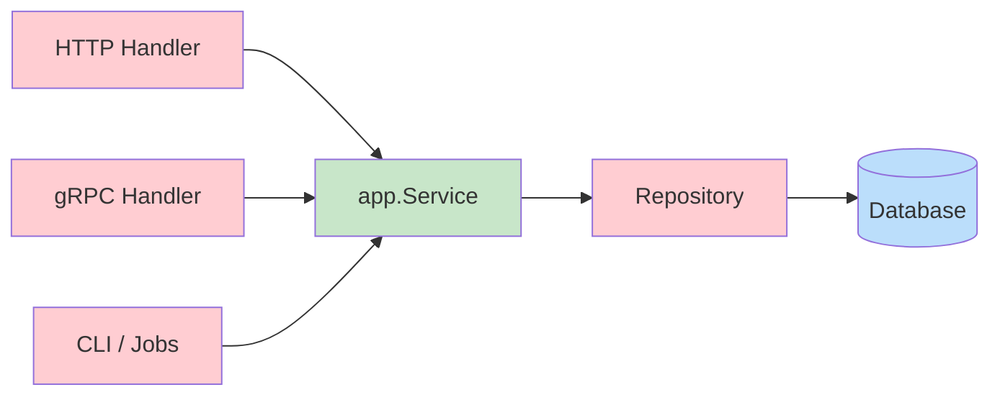

# Application Layer Types

Take another look at your repository.
Right now, `RegisterCustomer` takes `http.RegisterCustomer` directly: a type generated from the [OpenAPI](https://academy.threedots.tech/knowledge/openapi) spec.
**That ties the database layer to the HTTP API.**
If you change the API schema, you have to update the repository too, even though nothing about the database changed.

When the project is small, one type for everything feels like a reasonable shortcut.
As it grows, coupling like this becomes a problem and is difficult to fix.

## When Types Diverge

Let's say the database needs a `PasswordHash` field that the HTTP API shouldn't expose.
If you use the same type for both, you could add a `json:"-"` tag and call it a day.
It'll work, although it's fragile and you could easily leak the field in some other context.

With more similar specific fields, and more systems using the type, you end up with many hacks to make it all work.
You work with multiple models but they're all tangled together in one struct.

Changing anything about this struct becomes risky, because you don't know which systems depend on which fields.

## Multiple Entry Points

In production systems, HTTP is rarely the only API.
You might also have [gRPC](https://academy.threedots.tech/knowledge/grpc), messages, CLI tools, or scheduled jobs.
Each entry point needs to call the same business logic, but each one has its own data types.

**If the logic lives inside the HTTP handler, you duplicate it for every new entry point.**

The fix is to give each entry point one job: **map its incoming request to a common application type, call the application logic, and map the response.**

## The Application Layer

**Think of the [application layer](https://academy.threedots.tech/knowledge/application-service) as the glue that holds everything together.**
It's the logic that remains when you strip away HTTP handling, database queries, and external API calls.
It orchestrates what happens when a request arrives, without knowing how the request got there or where the data ends up.

For now, there are just two components in the application layer: the `Customer` type and the `Service` struct.



The application service goes between the HTTP handler and the repository.
It depends on the `CustomerRepository` interface:

```go
type Service struct {
	customerRepository CustomerRepository
	modules            ModulesContract
}
```

The `CustomerRepository` interface now lives in the `app` package too, next to the type it uses.
The application layer owns the contract with the database:

```go
type CustomerRepository interface {
	RegisterCustomer(ctx context.Context, customer Customer) error
}
```

Application types use either primitive or shared types, nothing specific to HTTP or the database.
They are supposed to be generic. They could be used in any context, by any API or adapter.

```go
type Customer struct {
	CustomerUUID common.UUID
	Name         string
	Email        string
	Address      shared.Address
	PhoneNumber  string
}
```

The HTTP handler now maps request types to application types and calls the service method:

```go
err = h.service.RegisterCustomer(ctx, app.Customer{
	CustomerUUID: customerUUID,
	Name:         request.Body.Name,
	Email:        string(request.Body.Email),
	Address:      addr,
	PhoneNumber:  request.Body.PhoneNumber,
})
```

The handler converts `openapi_types.Email` to `string`, OpenAPI's `Address` to `shared.Address`, and constructs an `app.Customer`.
On the other side, the repository receives `app.Customer` and maps it to database parameters.
**Each layer converts between the generic app types and the types it needs.**

{{conversation "From a Past Code Review"}}

{{message "robert"}}

Should we use positional arguments in struct literals? `app.Customer{customerUUID, name, email, addr, phone}` is shorter. And there's a safety benefit: when someone adds a new field to `Customer`, the positional version won't compile until you add the new value. With named fields, the compiler silently zero-initializes the missing field.

{{endmessage}}

{{message "milosz"}}

That's a fair point about catching missing fields. But positional has a worse failure mode: if two adjacent fields have the same type (like `Name` and `Email`, both `string`), swapping them compiles fine and you get a silent bug. Named fields make the mapping explicit and reviewable.

{{endmessage}}

{{message "robert" "milosz:+1"}}

So it's a tradeoff. Positional catches missing fields, named catches reordered fields and reads better. Both are valid.

Let's stick to named fields here, but positional could also be fine as long as we have good test coverage to catch missing or swapped fields.

{{endmessage}}

{{endconversation}}

The wiring happens in `backend/orders/module.go`.
It creates the repository, passes it to `app.NewService`, and passes the service to the HTTP handler.

The `Service` doesn't do much yet. It passes the call through to the repository. That's fine. It gives us the right structure to build on.

If you'd like to read more about this approach, see our blog post: [How to implement Clean Architecture in Go](https://threedots.tech/post/introducing-clean-architecture/).

{{tip}}

You may have noticed the `ModulesContract` interface in `app.Service`. It's empty for now. We'll use it soon for communication between modules.

{{endtip}}

{{tip}}

You might think this is too much ceremony for a `RegisterCustomer` call that just passes data through. We've heard that many times. Then we've watched those same teams struggle to add a single field, because it meant touching the HTTP handler, the database layer, and three shared types that were all tangled together. If you're taking this training, chances are you've seen projects like that too.

Knowing how to use a pneumatic hammer doesn't mean you should nail every picture frame with it. For small applications with one entry point and straightforward data flow, skipping the application layer is fine. But the project in this training is deliberately complex, and **the application layer will shine as we add more features.**

Remember, we're building a project that can keep growing while being maintained by a group of engineers.

For more on this topic, see our podcast episode [Is Clean Architecture Overengineering?](https://threedots.tech/episode/is-clean-architecture-overengineering/) and our blog post [Common anti-patterns in Go web applications](https://threedots.tech/post/common-anti-patterns-in-go-web-applications/).

{{endtip}}

## Exercise

Exercise path: ./project

The `app` package scaffolding is already there with `Customer`, `CustomerRepository`, and `Service`.
The `backend/orders/module.go` wiring and tests are already updated.

Your job is to connect the two infrastructure sides (the HTTP handler and the database repository) to the new application layer.

1. Update `backend/orders/api/http/handler.go` to depend on `*app.Service` instead of `CustomerRepository`. Map the HTTP request fields to `app.Customer` and call `RegisterCustomer`.
2. Update `backend/orders/adapters/db/customer_repo.go` to accept `app.Customer` as an argument. Remove the old `http` import and the separate `customerUUID` parameter.

{{hints}}

{{hint 1}}

Your HTTP handler should now look like this:

```go
type Handler struct {
	service *app.Service
}

func NewHandler(service *app.Service) Handler {
	if service == nil {
		panic("service cannot be nil")
	}

	return Handler{
		service: service,
	}
}
```

{{endhint}}

{{hint 2}}

In `backend/orders/adapters/db/customer_repo.go`, change the signature to:

```go
func (r *CustomerRepository) RegisterCustomer(ctx context.Context, customer app.Customer) error {
```

{{endhint}}

{{endhints}}
