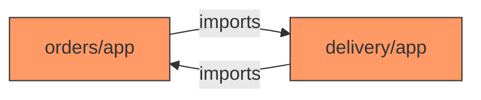
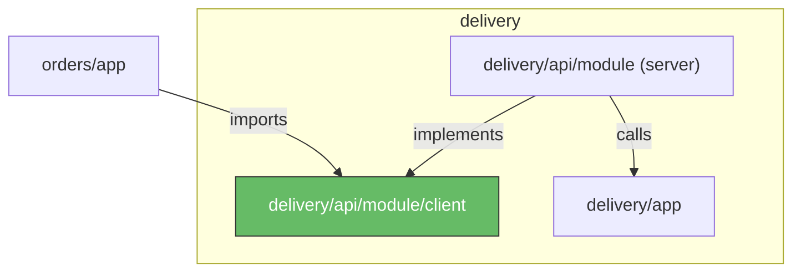

# Delivery Service

The `type ModulesContract interface{}` has been sitting empty in `backend/orders/app/service.go` since the first exercises. Meanwhile, the delivery fee has been hardcoded to `decimal.NewFromInt(10)` because the orders module had no way to ask the delivery module for the real number. It's time to fill that gap.

{{message "robert"}}

We've built a delivery module. It lives in `backend/delivery/` and has a `CalculateDeliveryFee` method that takes the restaurant address, delivery address, currency, and time. For now, it returns a hardcoded value, but the interface is in place for more complex logic later (distance-based pricing, surge pricing, etc.).

We've also wired the module contract setup so the delivery module registers itself at startup. Your job is to connect the orders module to it.

{{endmessage}}

## Why module contracts?

Why not call delivery functions directly from the orders module? For the same reason microservices expose APIs instead of sharing code. **If a module can only be reached through a defined interface, you can't accidentally couple to its internals.** Without that boundary, you end up with a big ball of mud where everything calls everything else.

There's also a team dimension. In a larger organization, the delivery fee calculation could be owned by a different team than order management. **Module contracts give each module a clear boundary that can evolve independently.**

To calculate the delivery cost, we need both addresses and the time. That's it. Under the hood, it could use advanced machine learning or a lookup table. The orders module doesn't care.

Adding module contracts does introduce some overhead. You have to define interfaces, request/response types, and wire things together. In a modular monolith, though, refactoring boundaries is much easier than in microservices. It can be done in a single PR.

{{tip}}

If defining module contracts feels like a burden, it may be a sign that your module boundaries need work. It's common to end up with too many modules. If that's the case, consider merging them.

For more on recognizing and fixing boundary problems, check out our podcast episode [The Distributed Monolith Trap](https://threedots.tech/episode/the-distributed-monolith-trap/).

{{endtip}}

## Import Cycles and the Client Package

Consider what happens if `orders/app` imports `delivery/app` directly. If `delivery/app` ever needs a type from `orders/app` (even indirectly), you get an import cycle. The Go compiler won't allow it.



We break this cycle with a **client package**. The `delivery/api/module/client` package defines the `Delivery` interface and the request/response types, but it has no imports from any module's internal code. It depends only on `common/shared` and the standard library.



**No arrow goes from `delivery/*` back to `orders/*`.** The client package is a leaf dependency that both sides can safely import.

The client package lives under `delivery/` (`delivery/api/module/client`), and the orders module imports it.

{{conversation "From a Past Code Review"}}

{{message "robert"}}

What if we put all module contracts into one struct and inject that everywhere? Less wiring.

{{endmessage}}

{{message "milosz" "robert:+1"}}

That hides real dependencies. If `OrderService` only needs delivery, its constructor should only take delivery. With one big struct, any module can call any other module, and you can't tell from the constructor what a service actually depends on. Explicit dependencies are worth the extra lines.

{{endmessage}}

{{endconversation}}

## The Module Contract Pattern

The module contract pattern in this project has four parts. Let's trace the request flow from orders to delivery.

**1. Client interface**. This defines the contract. Take a look at the `Delivery` interface:

{{codeFile "backend/delivery/api/module/client/client.go"}}

```go
type Delivery interface {
	CalculateDeliveryFee(ctx context.Context, req CalculateDeliveryFeeRequest) (CalculateDeliveryFeeResponse, error)
}

type CalculateDeliveryFeeRequest struct {
	RestaurantAddress shared.Address
	DeliveryAddress   shared.Address
	Currency          shared.Currency
	When              time.Time
}

type CalculateDeliveryFeeResponse struct {
	GrossFee decimal.Decimal
}
```

Notice how the request and response types use `shared.Address` and `shared.Currency`, not any types from `delivery/app`. **The idea is to keep module contract types separate from internal module types**, just like we don't expose internal models through our HTTP API.

It may look like a nice shortcut to reuse internal types, but in the long term it makes working with the project harder, especially with more teams. We covered this in our [When to avoid DRY](https://threedots.tech/post/things-to-know-about-dry/) article.

**2. Server implementation**. This implements the client interface by calling the delivery app service. It unpacks the client request struct and passes each field as a separate argument:

{{codeFile "backend/delivery/api/module/module.go"}}

```go
func (i Delivery) CalculateDeliveryFee(ctx context.Context, req client.CalculateDeliveryFeeRequest) (client.CalculateDeliveryFeeResponse, error) {
	fee, err := i.service.CalculateDeliveryFee(
		ctx,
		req.RestaurantAddress,
		req.DeliveryAddress,
		req.Currency,
		req.When,
	)
	// ...
}
```

**3. Contracts registry**. This struct collects all module contract implementations by embedding their client interfaces:

{{codeFile "backend/common/module/contracts/contracts.go"}}

```go
type Contracts struct {
	ordersModule.Orders
	deliveryModule.Delivery
}
```

After all modules register their implementations, `Verify()` checks that nothing is nil. It catches wiring mistakes at startup instead of when a user hits an endpoint.

**4. Module registration**. Each module's `RegisterContracts` method sets its implementation on the shared `Contracts` struct:

{{codeFile "backend/delivery/module.go"}}

```go
func (m *Module) RegisterContracts(ctx context.Context, contracts *contracts.Contracts) error {
	contracts.Delivery = module.New(m.service)
	return nil
}
```

In `backend/svc.go`, the `Contracts` struct is created as a pointer (`moduleContracts := &contracts.Contracts{}`) **before** modules register their implementations. Modules receive this pointer during initialization, so their `RegisterContracts` calls mutate the same struct.

After all modules are registered, `moduleContracts.Verify()` runs. Then HTTP handlers are registered, so by the time the first request arrives, all module contract wiring is in place.

That's the high-level idea. It's more files than a direct function call, but each one has a clear job. If you've used [gRPC](https://academy.threedots.tech/knowledge/grpc), the pattern is similar: a client interface defining the contract, a server implementation behind it, and a registry that wires them together.

You might wonder why `contracts` lives in `common/module/contracts/` rather than directly in `common/module/`. The `Module` interface in `common/module/module.go` includes `RegisterContracts(*contracts.Contracts)`, so `common/module` must import `contracts`. If `Contracts` were defined inside `common/module`, the package would be importing itself.

By splitting it into a sub-package, both `common/module` and each module's `module.go` can import `contracts` without any cycle.

{{tip}}

For even stricter encapsulation, Go supports [internal packages](https://pkg.go.dev/cmd/go#hdr-Internal_Directories). Code under an `internal/` directory can only be imported by code in the parent tree. We don't use them in this project, but they're worth knowing about.

{{endtip}}

## Exercise

Exercise path: ./project

Replace the hardcoded delivery fee in the orders module with a module contract call to the delivery module.

1. In `backend/orders/app/service.go`, fill in the empty `ModulesContract` interface with a `CalculateDeliveryFee` method. The method signature must match the `Delivery` interface from the client package (`eats/backend/delivery/api/module/client`).

2. In `backend/orders/app/orders.go`, add a `GetRestaurant` method to the `OrderRepository` interface returning `(Restaurant, error)`. The repository already implements this method, so you only need the interface declaration. Call `GetRestaurant` and `CalculateDeliveryFee` **before** `repo.CreateQuote`. The `CreateQuote` callback also changes: replace the separate `restaurantCurrency shared.Currency` and `restaurantAddress shared.Address` parameters with a single `restaurant Restaurant`. The repository already handles the new callback signature. Update the callback body to use `restaurant.Address` and `restaurant.Currency`, and use `deliveryFee.GrossFee` where you previously used `deliveryFeeGross`.

{{tip}}

The module call runs **outside** the database transaction. A slow or unavailable delivery service would hold an open database connection for the entire call duration, and under load that can exhaust the connection pool and affect unrelated queries. Keeping external calls outside the transaction avoids this.

{{endtip}}

The platform will verify that a restaurant can be onboarded and a customer can be registered, and that quote creation uses the delivery module's fee calculation.

{{hints}}

{{hint 1}}

The `ModulesContract` interface in `backend/orders/app/service.go` needs this import and method:

```go
import (
	"context"

	"eats/backend/delivery/api/module/client"
)

type ModulesContract interface {
	CalculateDeliveryFee(ctx context.Context, req client.CalculateDeliveryFeeRequest) (client.CalculateDeliveryFeeResponse, error)
}
```

The import path `eats/backend/delivery/api/module/client` points to the client package, not the server implementation. This is what keeps the import direction correct and avoids cycles.

{{endhint}}

{{hint 2}}

In `backend/orders/app/orders.go`, call `GetRestaurant` and `CalculateDeliveryFee` **before** `repo.CreateQuote`. Note the two-value error return (`return Quote{}, err`) outside the closure:

```go
restaurant, err := s.orderRepository.GetRestaurant(ctx, req.RestaurantUUID)
if err != nil {
	return Quote{}, err
}

deliveryFee, err := s.modules.CalculateDeliveryFee(ctx, client.CalculateDeliveryFeeRequest{
	RestaurantAddress: restaurant.Address,
	DeliveryAddress:   req.DeliveryAddress,
	Currency:          restaurant.Currency,
	When:              time.Now(),
})
if err != nil {
	return Quote{}, fmt.Errorf("error calculating delivery fee for quote: %w", err)
}
```

The `deliveryFee` variable is captured by the closure from the outer scope. Use `deliveryFee.GrossFee` inside the closure where you previously used `deliveryFeeGross`. Inside the closure, errors still use the three-value return: `return Quote{}, nil, err`.

The closure passed to `repo.CreateQuote` also changes its signature. Instead of separate `restaurantCurrency` and `restaurantAddress` parameters, it now receives a single `restaurant Restaurant`. The `OrderRepository` interface and the closure literal need to match. The repository implementation already uses the new signature.

{{endhint}}

{{endhints}}
